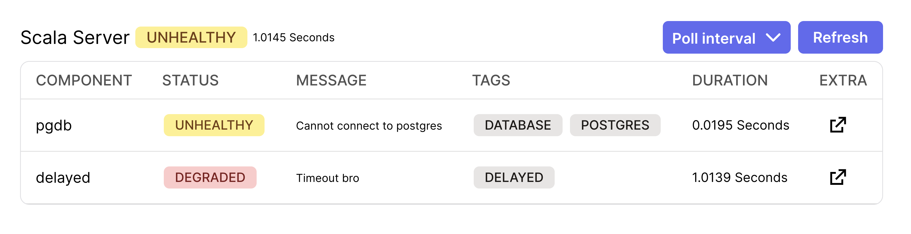

# Heart

Scala healthcheck library. 

It supports Akka Http, Http4s, Tapir servers and clients.


## Health checks
Healthchecks have such declaration, which makes them Effect agnostic.

```scala
abstract class HealthCheck[F[_]](
    val name: String,
    val description: Option[String] = None,
    val tags: List[String] = Nil,
    val extra: Map[String, HealthExtra] = Map.empty,
) {
  self =>
  def check: F[HealthState]
}


case class HealthState(
  status: HealthStatus,
  message: Option[String] = None,
  extra: Map[String, HealthExtra] = Map.empty,
)

sealed trait HealthStatus 
case object Healthy   extends HealthStatus
case object Degraded  extends HealthStatus
case object Unhealthy extends HealthStatus
```
There are a number of predefined healthchecks utilities:
* http status code checks for http4s, tapir, akka-http
* Doobie database checks
* Redis checks
* Cassandra checks
* Checks Cashing 
* Kafka fs2 check
* Slack health bot
* Http4s, Tapir, Akka Http endpoint interpereters for Health API
* Zio interop
* Cats interop

## Healthcheck UI
Library provides healthcheck UI that shows health report for all service components.


## Usage 

Define healthchecks
```scala
case class PostgresHealthCheck(jdbcUrl: String)
    extends HealthCheck[Task](
      name = "postgres",
      description = Some("Checks that connection with Postgres is alright"),
      tags = List("database", "postgres"),
      extra = Map("jdbcUrl" -> StringExtra(jdbcUrl)),
    ) {
  val check: Task[HealthState] =
    ZIO.ifZIO(Random.nextBoolean)(
      onTrue = ZIO.succeed(HealthState.healthy()),
      onFalse = ZIO.fail(new RuntimeException("Cannot connect to postgres")),
    )
}

case class DelayedHealthCheck(url: String)
    extends HealthCheck[Task](
      name = "delayed",
      description = Some("Delayed check"),
      tags = List("delayed"),
      extra = Map("delay" -> StringExtra("1 second")),
    ) {
  val check: Task[HealthState] =
    ZIO
      .succeed(HealthState.healthy(message = Some("All looks good")))
      .delay(1.second)
}
```

Create Health API
```scala
val healthApi: HealthApi[Task] =
  HealthApi(
    PostgresHealthCheck("jdbc:postgresql://localhost/jap?user=pavel&password=kravec&ssl=true").name("pgdb"),
    DelayedHealthCheck("https://jap-company.github.io/fields/"),
    Http4sStatusCodeHealthCheck(Request[Task](uri = Uri.unsafeFromString("http://localhost:3000")))
      .tags(List("frontend"))
      .addTags("admin", "react")
      .addExtra("service", "http://localhost:3000")
      .modify(_.addExtra("url", "http://localhost:3000")),
  )
    .timeoutTo(HealthState.degraded(message = Some("Timeout bro")), 1.second)
    .recover((e: Throwable) => HealthState.unhealthy(message = Some(e.getMessage)))
    .modify(_.addExtra("server", "http://localhost:8080"))
```

Create HTTP endpoints and use them in your server
```scala
val endpoints = HealthTapirEndpoints(healthApi, HeartServerConfig.default.enableAdminUI).healthEndpoints
```